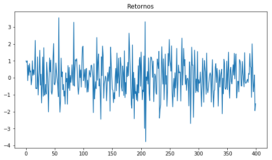
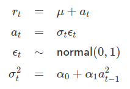
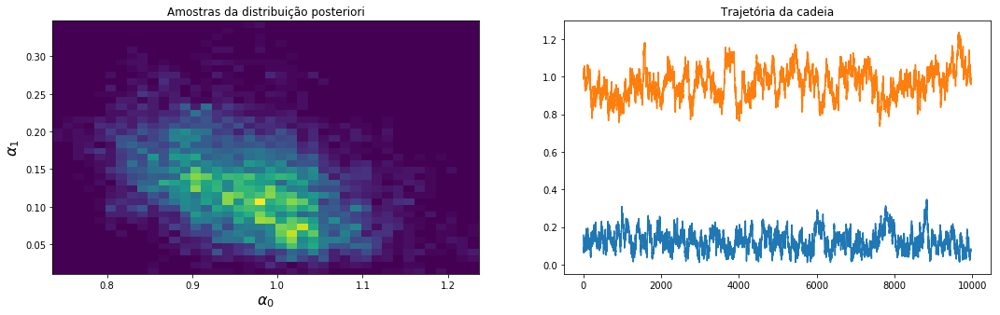

## Metropolis-Hastings e FBST

Implementação simples do amostrador Metropolis-Hastings e a medida de evidência de testes *Full Bayesians Significance Test* (FBST).

### Exemplo: ARCH(1) Bayesiano

#### Modelo

Assumindo priors alpha_0 ~ Exponencial(1) e alpha_1 ~ Exponencial(1).

#### Resultados

Ver completo em [link](/notebooks/Full%20Bayesian%20ARCH.ipynb)
